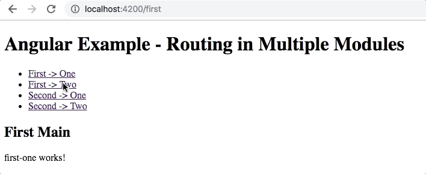

# Angular example - Routing in multiple modules

This project shows how the routing works between App and child modules.
It was generated with [Angular CLI](https://github.com/angular/angular-cli) version 6.0.8.

## Demo



## File Structure
```
├─ app-routing.module.ts
├─ app.component.ts
├─ app.component.html
├─ app.module.ts
├─ [first]
│  ├─ first-routing.module.ts
│  ├─ first.module.ts
│  ├─ [main]
│  │  ├─ main.component.html
│  │  └─ main.component.ts
│  ├─ [one]
│  │  ├─ one.component.html
│  │  └─ one.component.ts
│  └─ [two]
│     ├─ two.component.html
│     └─ two.component.ts
└─ [second]
    ├─ second-routing.module.ts
    ├─ second.module.ts
    ├─ [main]
    │  ├─ main.component.html
    │  └─ main.component.ts
    ├─ [one]
    │  ├─ one.component.html
    │  └─ one.component.ts
    └─ [two]
      ├─ two.component.html
      └─ two.component.ts
```

## Install

Run `npm install` for node modules.

## Run

Run `ng serve` for a dev server. Navigate to `http://localhost:4200/`.
