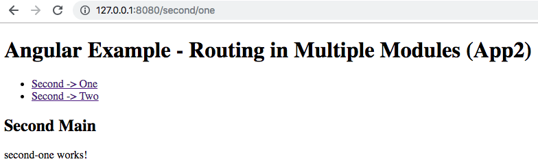

# Angular example - Routing in multiple modules + ng build with different application config for module exclusion

This demo project is here for two purposes:
1. How the routes works between app module and other child modules.
2. How to do `ng build` for multiple production bundles with different modules.

(It was generated with [Angular CLI](https://github.com/angular/angular-cli) version 6.2.3.)

## Demo

### 1. Routing in multiple modules


### 2. `ng build` for another application without module 'first'


## Files Structure for Routing Demo
```
├─ [app]
│   ├─ [login]
│   │   ├─ login.component.html
│   │   └─ login.component.ts
│   ├─ [main]
│   │   ├─ main-routing.module.html
│   │   ├─ main.component.html
│   │   ├─ main.component.ts
│   │   └─ main.module.ts
│   ├─ app-routing.module.ts
│   ├─ app.component.ts
│   ├─ app.component.html
│   ├─ app.module.ts
├─ [app2]
│   ├─ [login]
│   │   ├─ login.component.html
│   │   └─ login.component.ts
│   ├─ [main]
│   │   ├─ main-routing.module.html
│   │   ├─ main.component.html
│   │   ├─ main.component.ts
│   │   └─ main.module.ts
│   ├─ app-routing.module.ts
│   ├─ app.component.ts
│   ├─ app.component.html
│   ├─ app.module.ts
└─ [modules]
    ├─ [first]
    │   ├─ first-routing.module.ts
    │   ├─ first.module.ts
    │   ├─ [main]
    │   │   ├─ main-first.component.html
    │   │   └─ main-first.component.ts
    │   ├─ [one]
    │   │   ├─ first-one.component.html
    │   │   └─ first-one.component.ts
    │   └─ [two]
    │       ├─ first-two.component.html
    │       └─ first-two.component.ts
    └─ [second]
        ├─ second-routing.module.ts
        ├─ second.module.ts
        ├─ [main]
        │   ├─ main-second.component.html
        │   └─ main-second.component.ts
        ├─ [one]
        │   ├─ second-one.component.html
        │   └─ second-one.component.ts
        └─ [two]
            ├─ second-two.component.html
            └─ second-two.component.ts
```

## Install

Run `npm install` for node modules.

## Run

### 1. Routing in multiple modules

Run `ng serve` for a dev server. Navigate to `http://localhost:4200/`.

### 2. ng build for different application

Run `ng serve --project="app2"` for a dev server with another application has no module 'first'.

## Build

### 1. Routing in multiple modules

Run `ng build` to generate built bundle in the folder 'dist/ng-routing-in-modules/'.

### 2. ng build for different application

* Run `ng build --project="app2"`, or
* Run `ng build --main src/main2.ts --output-path dist/app2` to generate built bundle in folder 'dist/app2/'.

The second command can be run without the following configuration block in the file 'angular.json'. But it is necessary if you would like to run dev server with the command `ng serve --project="app2"`.

```json
"app2": {
  "root": "",
  "sourceRoot": "src",
  "projectType": "application",
  "prefix": "app2",
  "schematics": {},
  "architect": {
    "build": {
      "builder": "@angular-devkit/build-angular:browser",
      "options": {
        "outputPath": "dist/app2",
        "index": "src/index.html",
        "main": "src/main2.ts",
        "polyfills": "src/polyfills.ts",
        "tsConfig": "src/tsconfig.app.json",
        "assets": [
          "src/favicon.ico",
          "src/assets"
        ],
        "styles": [
          "src/styles.css"
        ],
        "scripts": []
      },
      "configurations": {
        "production": {
          "fileReplacements": [
            {
              "replace": "src/environments/environment.ts",
              "with": "src/environments/environment.prod.ts"
            }
          ],
          "optimization": true,
          "outputHashing": "all",
          "sourceMap": false,
          "extractCss": true,
          "namedChunks": false,
          "aot": true,
          "extractLicenses": true,
          "vendorChunk": false,
          "buildOptimizer": true
        }
      }
    },
    "serve": {
      "builder": "@angular-devkit/build-angular:dev-server",
      "options": {
        "browserTarget": "app2:build"
      },
      "configurations": {
        "production": {
          "browserTarget": "app2:build:production"
        }
      }
    },
    "extract-i18n": {
      "builder": "@angular-devkit/build-angular:extract-i18n",
      "options": {
        "browserTarget": "app2:build"
      }
    },
    "test": {
      "builder": "@angular-devkit/build-angular:karma",
      "options": {
        "main": "src/test.ts",
        "polyfills": "src/polyfills.ts",
        "tsConfig": "src/tsconfig.spec.json",
        "karmaConfig": "src/karma.conf.js",
        "styles": [
          "src/styles.css"
        ],
        "scripts": [],
        "assets": [
          "src/favicon.ico",
          "src/assets"
        ]
      }
    },
    "lint": {
      "builder": "@angular-devkit/build-angular:tslint",
      "options": {
        "tsConfig": [
          "src/tsconfig.app.json",
          "src/tsconfig.spec.json"
        ],
        "exclude": [
          "**/node_modules/**"
        ]
      }
    }
  }
}
```